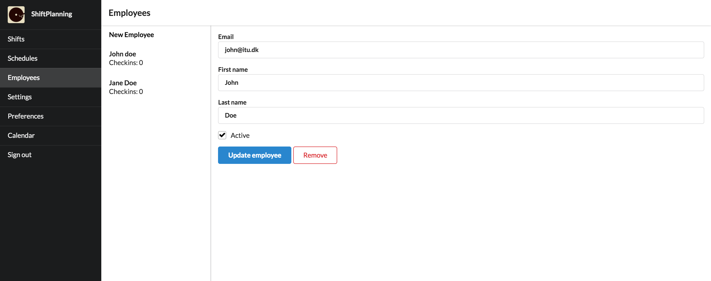
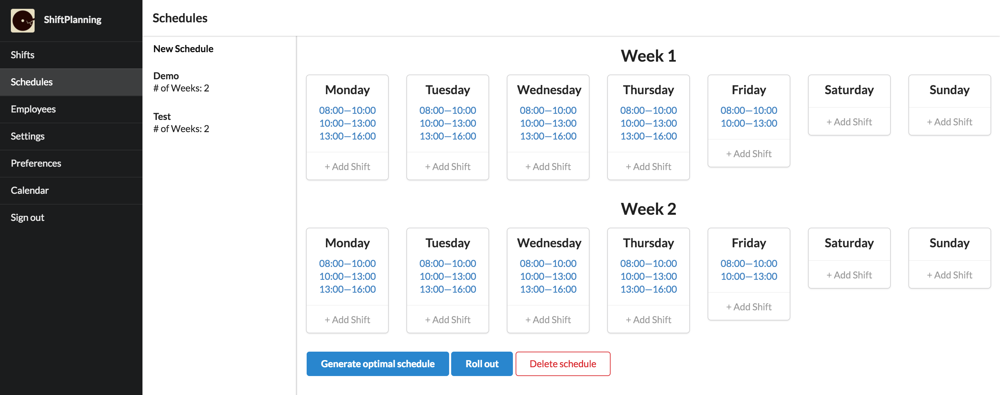
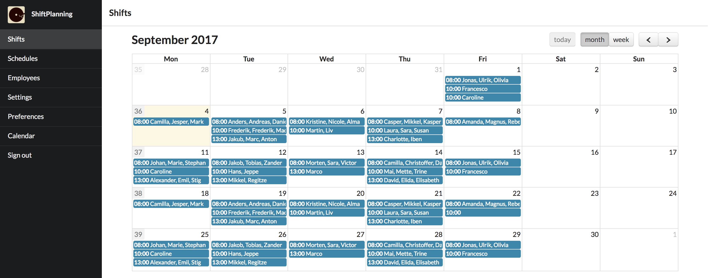

# ShiftPlanning

ShiftPlanning makes it easy to assign employees to different scheduled shifts.
With a click of a button, an optimal schedule can be generated that will take
each employees preferences into consideration.

## Screenshots

We do not have a test account or organization at the moment. Instead we can
provide some screenshots to provide an idea for the application.

### Employees

### Schedules

### Shifts

